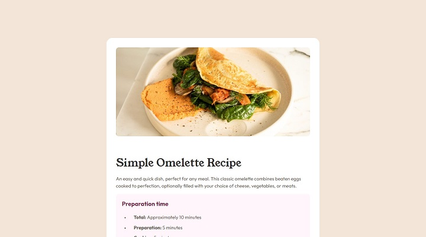
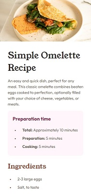

# Frontend Mentor - Recipe page solution

This is a solution to the [Recipe page challenge on Frontend Mentor](https://www.frontendmentor.io/challenges/recipe-page-KiTsR8QQKm). Frontend Mentor challenges help you improve your coding skills by building realistic projects.

## Table of contents

- [Overview](#overview)
  - [The challenge](#the-challenge)
  - [Screenshot](#screenshot)
  - [Links](#links)
- [My process](#my-process)
  - [Built with](#built-with)
  - [What I learned](#what-i-learned)
- [Author](#author)

## Overview

### Screenshot

### Links

- Solution URL: [GitHub repo](https://github.com/kemenyfa-szu/frontendmentor-014-recipe-page)
- Live Site URL: [GitHub pages](https://kemenyfa-szu.github.io/frontendmentor-014-recipe-page)

## My process

### Built with

- Semantic HTML5 markup
- Vanilla CSS

### What I learned

- You can make content for screen-readers only by positioning so called content outside the viewport. I thought there was a more a professional solution for this.

## Author

- Frontend Mentor - [@kemenyfa-szu](https://www.frontendmentor.io/profile/kemenyfa-szu)
